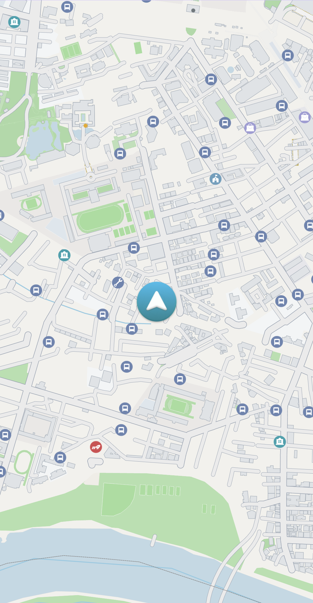

# 지도

## 지도 추가하기&#x20;

`Activity`의 레이아웃 XML 파일에  지도가 추가될 FragmentContainerView와 OrbisMapLayer를 추가하면 됩니다.&#x20;


안내기능 사용 시 반드시 안내 화면이 표출될 [OrbisMapLayer](https://inavi-systems.github.io/Inavi-navigation-sdk-reference/navisdk-aos-ui/com.inavisys.navisdk.ui.map/-orbis-map-layer/index.html)를 아래에 선언하여야 합니다.


```xml
<androidx.fragment.app.FragmentContainerView
    android:id="@+id/map_container"
    android:layout_width="match_parent"
    android:layout_height="match_parent"/>

<com.inavisys.navisdk.ui.map.OrbisMapLayer
    android:id="@+id/orbis_map_layer"
    android:layout_width="match_parent"
    android:layout_height="match_parent"/>
```

<figure><figcaption><p>지도 표출 예시</p></figcaption></figure>

### 지도컨트롤

기본적으로 제공되는 지도를 클릭 하거나 드래그 할 시 지도 컨트롤 버튼이 표출됩니다.

<figure><figcaption><p>지도컨트롤 표출 (지도 클릭 시)</p></figcaption></figure>

### 지도 컨트롤 버튼 세부 설명

지도 컨트롤 버튼은 다음과 같습니다&#x20;

<div><figure><figcaption></figcaption></figure> <figure><figcaption><p>주행모드 아이콘</p></figcaption></figure> <figure><figcaption></figcaption></figure></div>

<div><figure><figcaption></figcaption></figure> <figure><figcaption><p>안내음성 아이콘</p></figcaption></figure> <figure><figcaption></figcaption></figure></div>

<figure><figcaption><p>현위치 아이콘</p></figcaption></figure>

<div><figure><figcaption><p>줌 인</p></figcaption></figure> <figure><figcaption><p>줌 아웃</p></figcaption></figure></div>
