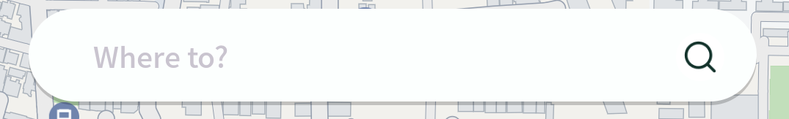
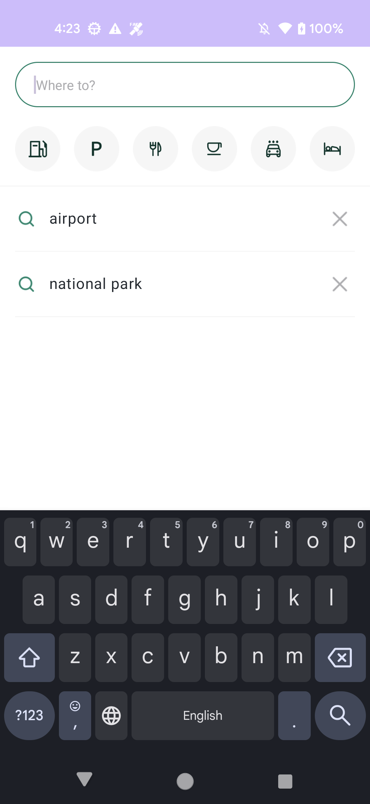
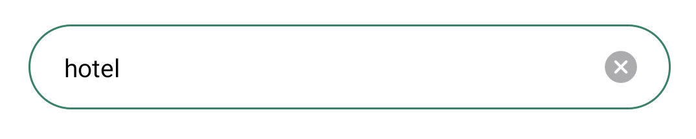
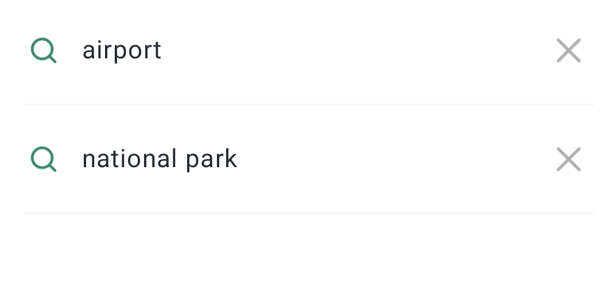
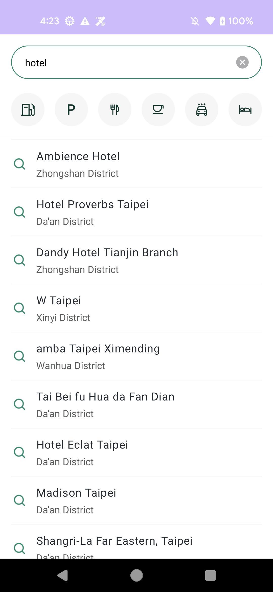

# 검색

## 검색 View 사용하기&#x20;

OrbisNaviSDK 에서 제공하는 검색 화면을 사용하면 손쉽게 검색 화면 및 기능을 구현할 수 있습니다.

`Activity`의 레이아웃 XML 파일에 ['SimpleSearchBarView'](https://inavi-systems.github.io/Inavi-navigation-sdk-reference/navisdk-aos-ui/com.inavisys.navisdk.ui.component/-simple-search-bar-view/index.html)를 추가하면 됩니다.

```xml
<com.inavisys.navisdk.ui.component.SimpleSearchBarView
        android:id="@+id/search_fragment_container"
        android:layout_width="match_parent"
        android:layout_height="wrap_content"
        app:layout_constraintTop_toTopOf="parent"
        app:layout_constraintStart_toStartOf="parent"
        app:layout_constraintEnd_toEndOf="parent"
    />
```

***

### SimpleSearchBarView 추가하기

<figure><figcaption><p>SimpleSearchBarView 가 표출된 모습</p></figcaption></figure>

['SimpleSearchBarView'](https://inavi-systems.github.io/Inavi-navigation-sdk-reference/navisdk-aos-ui/com.inavisys.navisdk.ui.component/-simple-search-bar-view/index.html) 를 클릭 시 검색화면이 표출됩니다, 검색어 입력창, 카테고리 검색, 검색 결과(또는 이전검색어)리스트가 순서대로 표출됩니다.&#x20;

기본 검색 화면은 다음과 같이 표출됩니다.

<figure><figcaption><p>검색 화면</p></figcaption></figure>

***

### 세부 화면 설명

<figure><figcaption><p>검색어 입력창</p></figcaption></figure>

<figure><figcaption><p>카테고리 검색 버튼</p></figcaption></figure>

<figure><figcaption><p>최근검색어 (최대 20개)</p></figcaption></figure>

***

### 검색 결과

검색 결과는 정확도 순서로 최대 20개까지 표출됩니다.&#x20;

해당 아이템을 클릭 하면 경로탐색을 요청하며, [경로탐색 결과 화면](undefined-4.md) 으로 전환됩니다.&#x20;

<figure><figcaption><p>검색 결과 화면</p></figcaption></figure>

***

## 검색 View를 사용하지 않고 API만 사용하기

## 검색 API 호출

[NaviContoller](https://inavi-systems.github.io/Inavi-navigation-sdk-reference/navisdk/core/com.inavisys.navisdk.core/-navi-controller/index.html)의 [runSearch](https://inavi-systems.github.io/Inavi-navigation-sdk-reference/navisdk/core/com.inavisys.navisdk.core/-navi-controller/run-search.html) 호출&#x20;

```kotlin
    // 검색어
    val strSearchQuery = "hotel"
    // 검색 요청 기준 좌표 (대체로 현위치)
    val reqSearchCoord = NaviController.getCurrentPosition().coordinate
    
    NaviController.runSearch(ReqSearch(strSearchQuery,reqSearchCoord), listener = object: OnSearchListener {
        override fun onSuccess(response: TomTomSearchResponse) {
                // 성공
        }

        override fun onFail() {
                // 실패            
        }
    })
```

주요 클래스는 다음과 같습니다.&#x20;

[ReqSearch](https://inavi-systems.github.io/Inavi-navigation-sdk-reference/navisdk/model/com.inavisys.navisdk.model.network.search/-req-search/index.html) , [OnSearchListener](https://inavi-systems.github.io/Inavi-navigation-sdk-reference/navisdk/core/com.inavisys.navisdk.core.controller/-on-search-listener/index.html) , [TomTomSearchResponse](https://inavi-systems.github.io/Inavi-navigation-sdk-reference/navisdk/model/com.inavisys.navisdk.model.network.search/-tom-tom-search-response/index.html)&#x20;


### TomTom GeoCoding API 호출

OrbisNaviSDK의 기능을 사용하여 [TomTom GeoCoding API](https://developer.tomtom.com/geocoding-api/documentation/product-information/introduction)를 사용할 수 있습니다.\


### TomTom RevGeoCoding API 호출&#x20;

OrbisNaviSDK의 기능을 사용하여 [TomTom ReverseGeoCoding API](https://developer.tomtom.com/reverse-geocoding-api/documentation/product-information/introduction)를 사용할 수 있습니다.


