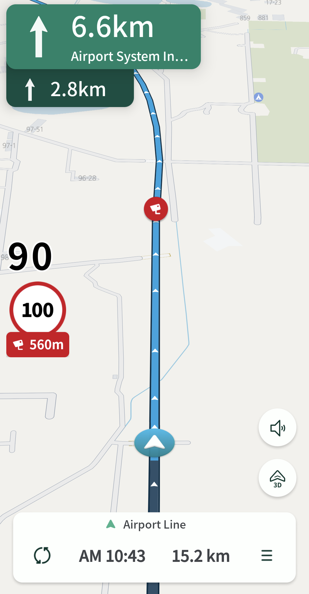
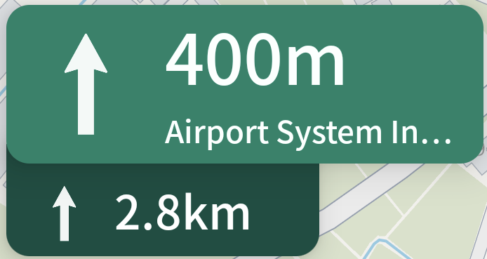
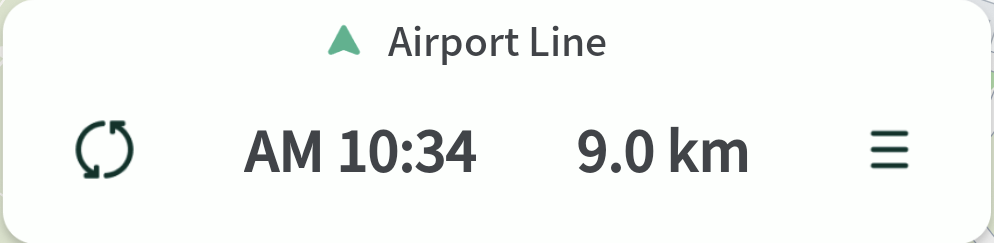
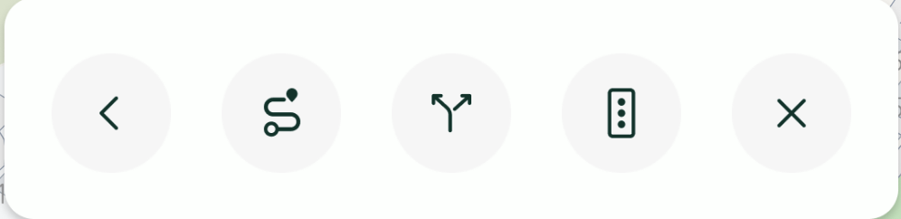

# 안내

## 안내 화면 설명&#x20;

OrbisNaviSDK 에서 제공하는 경로탐색 화면을 통해 선택한 경로의 안내시작 버튼을 선택할 경우 경로탐색 화면으로 진입합니다.

<figure><figcaption>
경로 주행 화면
</figcaption></figure>

***

### 안내 컴포넌트 소개

<figure><figcaption>
TurnView
</figcaption></figure>

다음, 다다음 안내 지점의 거리, 도로명, [Turn 정보](https://inavi-systems.github.io/Inavi-navigation-sdk-reference/navisdk/model/com.inavisys.navisdk.model.route/-orbis-turn-type/index.html) 를 표출

***

<figure><figcaption>
주행중인 속도
</figcaption></figure>

<figure><figcaption>
안전운행 알림 아이콘
</figcaption></figure>

현재 주행중인 속도, 안전운행 알림 아이콘 (과속 단속 지점 안내 등)&#x20;

***

<figure><figcaption>
BottomView (기본 상태)
</figcaption></figure>

현재 주행중인 도로명, 수동 재탐색, 도착 예정시간, 남은 거리, 더보기

<figure><figcaption>
BottomView (더보기 상태)
</figcaption></figure>

뒤로가기, 전체경로보기, 목적지 재설정, CTT, 경로안내취소&#x20;

